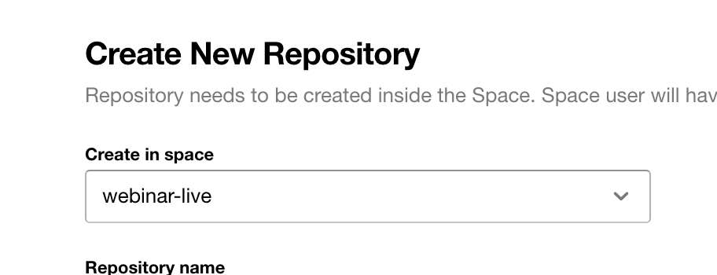
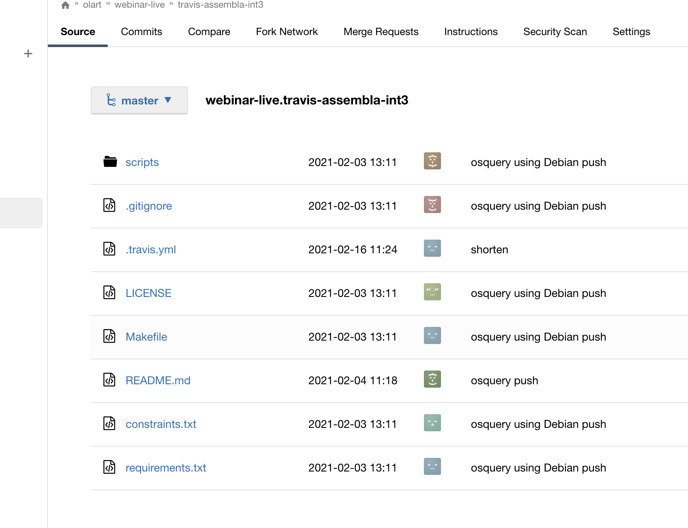
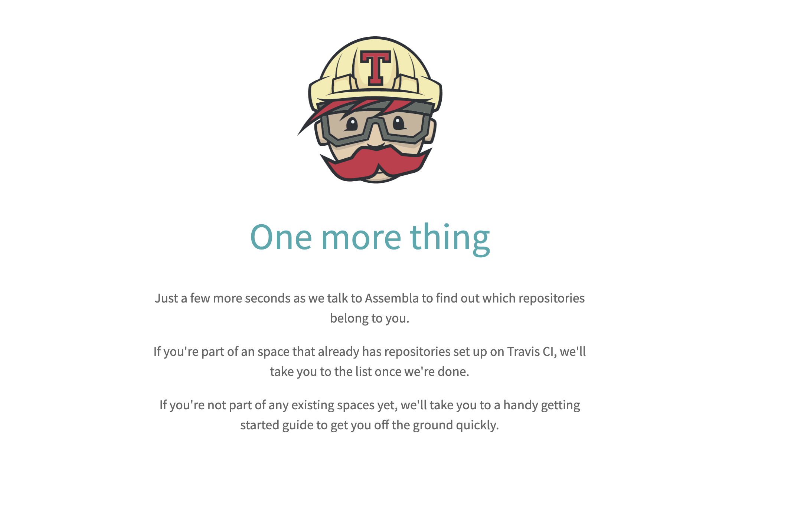
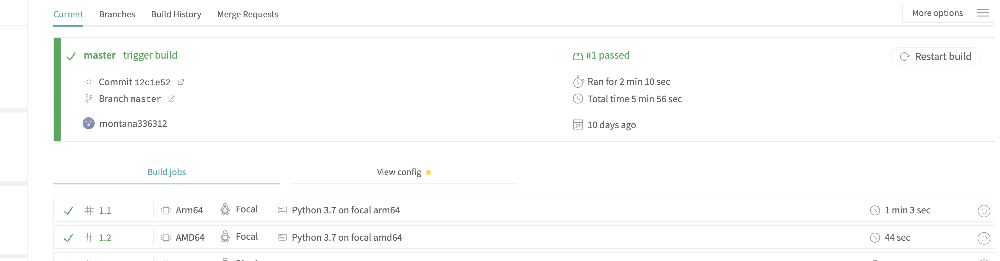

# Intro

In February we hosted the first Travis CI webinar in collaboration with Assembla, to show you how easy it is to import an existing repo from GitHub into Assembla’s version control system (VCS) and get up and running with building your project in Travis CI! If you have any questions or comments about the session, feel free to leave them on the video comments section and we’ll be sure to get back to you!

The response to the session has been overwhelmingly positive - so much so that we’re already planning our next webinar, [“Using Experimental CLI Commands with Docker”](https://landing.travis-ci.com/webinar/) for March! We’ll be looking forward to seeing you there!

# [Integraitng Assembla and Travis CI into your workflow](https://www.youtube.com/watch?v=RXzcXyitNLk&t=220s)

* Go to www.travis-ci.com and sign up with Assembla
* Accept the auth of Travis CI, next you’ll be redirected to Assembla
* Click on your profile picture, click settings, and toggle the repos you want to use with Travis CI
* You’ll next need to add a .travis.yml file to your repo to tell Travis CI what to do

# The Assembla UI 

First you want to create a new repository, from there you want to use the `import repository` function, from there, grab the URL of the repository you wnat to import from GitHub. 

 

# I’ve imported the repository, now what?

Once imported, you should see a file tree, much like you would in any other VCS, should look the like the following: 

# Space Settings 

Now you can see the source tree, time to change the repo to public, since by default the repository is private. You'll want to go click Space **Settings -> Security**, then change the security settings to "All" like below:

# Connecting to Travis CI 

Now you'll want to go to www.travis-ci.com, make sure your logged in with your Assembla account, next you'll see the following screen once you're logging in:

 

It will notify you that Assembla/Travis are syncing your repos, any changes you may have made. Once you're in the Travis CI, use it as you normally would with any other VCS. Start a build with a `.travis.yml`. 

 

# In conclusion 

We've just integrated Assembla and Travis CI into our project by using the `import` feature in Assembla very quick and easily. If you have any questions please feel free to post them in the video comments section. 

Happy building! 
